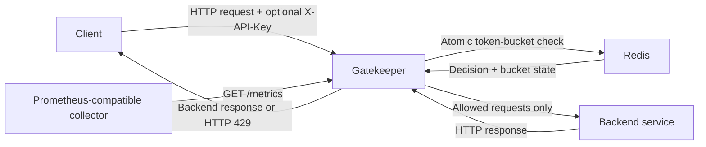
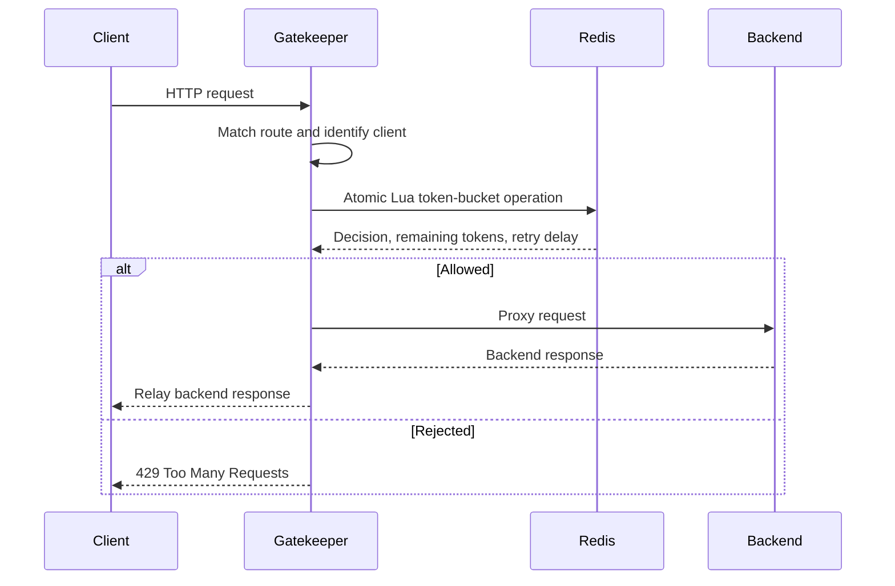

# Gatekeeper Architecture

## Purpose

Gatekeeper is a distributed rate-limiting API gateway. It sits between clients
and backend services. Shared Redis state lets it enforce per-client and
per-route traffic policies before proxying allowed requests.

The project is designed to demonstrate:

- concurrency-safe rate limiting across multiple gateway instances;
- atomic state transitions in Redis;
- configurable routing and client-specific policies;
- explicit dependency-failure behavior;
- production-oriented observability and shutdown behavior; and
- reproducible correctness and performance testing under concurrent load.

## System context

Redis is the source of truth for rate-limit state. Multiple Gatekeeper
instances consult the same buckets, so adding gateway instances does not
multiply a client's allowance.

## Request lifecycle

1. Gatekeeper accepts an HTTP request and assigns or preserves a request ID.
2. Reserved internal endpoints bypass application routing. `/health` and
   `/ready` are reserved for service checks. `/metrics` is reserved for
   monitoring output.
3. The HTTP method and path are matched to a configured route.
4. The client is identified by `X-API-Key`, with the direct peer IP as a
   fallback.
5. The route identity and hashed client identity form the Redis bucket key.
6. Gatekeeper executes one Redis Lua script. It refills the bucket before
   deciding whether to consume a token.
7. Redis returns an allow-or-reject decision. The response also includes the
   remaining-token count and retry delay.
8. A rejected request receives `429 Too Many Requests` and never reaches the
   backend.
9. An allowed request is forwarded through a reverse proxy to the configured
   backend. Gatekeeper then relays the backend response to the client.
10. Gatekeeper records structured logs and request metrics.

## Component responsibilities

### `cmd/gateway`

The gateway executable is the composition root. It loads configuration and
connects to dependencies. It then assembles the HTTP handlers and starts the
server. It also coordinates graceful shutdown.

### `internal/config`

Defines the configuration types and loads YAML files. It applies defaults before
validating the result. Invalid configuration prevents startup and produces an
actionable error.

### `internal/gateway`

Owns route matching and client identification. It applies rate-limit middleware
before coordinating the reverse proxy. Reserved endpoints are handled directly.

### `internal/limiter`

Exposes the rate-limiter interface and its Redis implementation. Keeping the
limiter behind an interface allows gateway unit tests to use deterministic test
doubles without requiring Redis.

### `internal/metrics`

Defines bounded Prometheus metrics. They measure request decisions and errors,
as well as in-flight work and latency. Raw API keys and IP addresses are never
used as metric labels.

### `cmd/mock-backend`

Provides predictable `/api/search` and `/api/upload` endpoints for local demos
and integration tests. It also exposes a request count so tests can prove that
rejected traffic did not reach the backend.

### Redis

Stores each bucket's token balance and last-refill timestamp. Idle buckets
expire automatically so abandoned client state does not accumulate forever.

## Token-bucket model

Each route rule defines a bucket capacity and refill rate. A new bucket starts
full. Every request costs one token. Unused tokens accumulate only up to the
configured capacity.

For example, a capacity of 5 with a refill rate of 1 token per second permits an
immediate burst of 5 requests, followed by approximately 1 additional request
per second.

Token bucket is preferred over a fixed-window counter because it permits
controlled bursts while avoiding the boundary spike created when one fixed
window ends and the next begins.

The limiter design will specify its exact calculations before implementation.
That specification will cover time representation and numeric precision. It
will define bucket expiration separately from retry-delay rounding.

## Concurrency and atomicity

A non-atomic `read -> check -> write` sequence is incorrect under concurrency.
If one token remains, two requests could both read that token before either
writes the new balance, allowing both requests through.

Gatekeeper sends the entire refill-check-consume transition to Redis as one Lua
script. Redis executes the script atomically, so each request observes the
state produced by the request before it. This maintains the configured limit
even when requests reach different gateway instances simultaneously.

Gateway instances do not maintain authoritative token balances in process
memory.

## Routing

Routes are defined in configuration. Each route specifies:

- an exact HTTP method;
- a path prefix;
- a backend URL;
- a default token-bucket rule; and
- optional client-specific overrides.

When multiple prefixes match, the longest matching prefix wins. Requests with
no matching method-and-path rule receive `404 Not Found` without contacting
Redis or a backend.

Reserved internal paths cannot be configured as backend routes.

## Client identification and trust boundary

Gatekeeper identifies a client using this order:

1. a non-empty `X-API-Key` header;
2. otherwise, the direct peer IP address from the network connection.

Raw identities are not written to any observability output or Redis key.
Gatekeeper uses a hashed representation where a stable identity-derived value
is required.

Gatekeeper does not trust `X-Forwarded-For` by default because an untrusted
client can forge it. Support for explicitly trusted upstream proxies is a
future deployment enhancement.

## Redis failure policy

Redis failure behavior is explicit and configurable. The default policy is
**fail-open**: if Redis is unavailable or the rate-limit operation times out,
Gatekeeper forwards the request and records the failure in logs and metrics.

Fail-open preserves API availability but temporarily removes rate-limit
protection. Deployments protecting authentication, payment, abuse-sensitive,
or expensive operations can choose **fail-closed**, which rejects traffic when
the limiter cannot make a decision.

This policy makes the availability-versus-protection tradeoff deliberate and
testable rather than accidental.

## Internal endpoints

| Endpoint | Purpose | Dependency behavior |
| --- | --- | --- |
| `GET /health` | Confirms the process is alive | Does not depend on Redis or a backend |
| `GET /ready` | Reports readiness for normal traffic | Includes Redis connectivity in its status |
| `GET /metrics` | Exposes Prometheus-format metrics | Served directly by Gatekeeper |

Internal endpoints bypass normal proxy routing and application rate-limit
rules.

## Reliability and proxy behavior

Every network boundary has an explicit timeout. The HTTP server and backend
transport each enforce one. The Redis client does as well, preventing stalled
connections from consuming resources indefinitely.

During graceful shutdown, Gatekeeper first stops accepting new traffic. Active
requests receive a bounded period to finish before the process exits.

The reverse proxy preserves the complete application request while applying
Go's standard handling for hop-by-hop headers. This includes the method and
target URL as well as applicable headers and body data. Client cancellation is
propagated to backend work.

## Observability

Structured logs will identify the request and describe its routing outcome. The
rate-limit decision is recorded alongside it. Separate fields capture timing
and dependency failures. Raw API keys will not be logged.

Prometheus metrics will include:

- total requests by route and decision;
- allowed and rejected requests;
- Redis and backend errors;
- in-flight requests;
- overall request latency; and
- backend latency.

Labels will use bounded values such as configured route names and status
classes. Client identities are deliberately excluded to avoid sensitive data
exposure and unbounded metric cardinality.

## Deployment model

Docker Compose will provide a reproducible local stack containing:

1. one or more Gatekeeper containers;
2. one Redis container; and
3. one mock-backend container.

The services communicate over a private Compose network. Because Redis owns
the rate-limit state, Gatekeeper can scale horizontally while preserving one
shared allowance per client and route.

## Technical decisions

| Area | Decision | Reason |
| --- | --- | --- |
| HTTP server | Go `net/http` | Production-capable standard library with a small dependency surface |
| Proxy | Go `httputil.ReverseProxy` | Established standard-library HTTP proxy behavior |
| Algorithm | Token bucket | Controlled bursts with smooth refill |
| Shared state | Redis | Consistent limits across horizontally scaled gateway instances |
| Atomicity | Redis Lua script | A race-free state transition for each request |
| Client identity | `X-API-Key`, then peer IP | Practical identity with a deterministic fallback |
| Redis outage | Configurable; fail-open by default | Explicit availability-versus-protection policy |
| Route selection | Exact method plus longest path prefix | Simple and deterministic matching |
| Observability | Structured logs and Prometheus metrics | Operational visibility and benchmark evidence |
| Deployment | Docker Compose | Reproducible, one-command demonstration environment |

## Project scope and future scaling paths

The completed Gatekeeper project will handle the full request path. That begins
with concurrent admission control and atomic distributed enforcement. It
continues through backend proxying and operational visibility. A containerized
environment makes that system reproducible. Integration tests prove component
behavior, while load tests provide measured evidence. This is the core system,
not a reduced demonstration.

The initial production-shaped scope uses HTTP with one Redis deployment.
Configuration is loaded at startup. This keeps the engineering focus on
correctness under concurrency. Failure behavior remains explicit. Performance
can be measured. Environments with broader operational requirements
could add:

- **Kubernetes deployment:** cluster orchestration with autoscaling. It could
  also provide rolling updates and service discovery.
- **Redis high availability:** replication with Sentinel or managed failover.
  The deployment would also need an explicit durability policy.
- **Multi-region rate limiting:** region-local performance balanced against
  cross-region consistency requirements.
- **Trusted-proxy support:** safe client-IP extraction behind known load
  balancers or content-delivery networks.
- **Dynamic policy administration:** authenticated runtime rule updates backed
  by validation. Policy versions and an audit history would make changes
  traceable.
- **gRPC proxying:** rate limiting for service-to-service RPC traffic in
  addition to HTTP APIs.
- **Operational dashboard:** visualization built on the metrics already exposed
  by Gatekeeper.

These enhancements build on the same limiter and gateway boundaries without
being necessary to demonstrate the project's central distributed-systems
claims.

## Architecture invariants

The implementation and tests must preserve these conditions:

1. A rejected request never reaches a backend.
2. One allowed request consumes exactly one token.
3. Concurrent gateway instances share the same Redis bucket state.
4. A bucket never refills beyond its configured capacity.
5. Internal endpoints are never forwarded to application backends.
6. Raw API keys are never persisted or emitted by Gatekeeper.
7. Redis failure behavior is deliberate and configurable. Every failure is
   observable.
8. Unknown routes do not consume rate-limit state or contact a backend.
